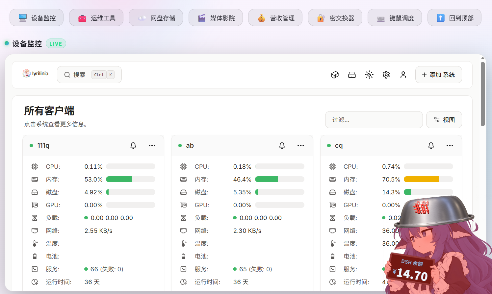

# VK-1 standalone dashboard pet (v0.1.1)

Independent web host for the MIT-licensed community VK-1 plugin. The native Windows/macOS implementations are unchanged. Adaptation lives here as 37 audited exact-anchor build patches applied to a separately checked-out community plugin.

## Features

- Bottom-right mirrored character; readable balance/menu text.
- Transparent pixels let dashboard clicks through; desktop right-click and mobile long-press menu.
- Mouse/touch dragging, position persistence and viewport bounds. Dragging across cross-origin iframes uses pointer capture plus a temporary transparent event layer, removed on release/cancel/unmount.
- Preserves feeding, rice, iron pot, deduction/charge demos, radar, expressions and sounds.
- Same-origin Python balance bridge: per-browser temporary keys or an opt-in server-side balance snapshot. No keys in JS/localStorage; USD is not labeled as CNY; stale balance is explicit and expires.
- Ordinary browser overlay, not a cross-application native desktop pet.

## Preview



## Build

Requires Node.js 20+, Python 3.10+, Git. Build-time source is intentionally separate and pristine: pinning rejects an unreviewed commit or changed file.

```sh
git clone https://github.com/YCTS-otree/VK-1.git community-reference
git -C community-reference checkout 696e8915e37ed3c12d35feff9bcd7702d1be6247
node integration/build.mjs standalone-0.1.0
python3 integration/backend-test.py
```

Serve the generated `releases/standalone-0.1.0/` at `/vk-1/` on an existing HTTPS dashboard and add:

```html
<script defer src="/vk-1/loader.js"></script>
```

For browser regression checks, install Puppeteer (`npm install --no-save --package-lock=false puppeteer`) and run `node integration/browser-test.cjs standalone-0.1.0`. Set `CHROME_BIN` if using a system Chrome. The 16 checks cover desktop/touch behavior, iframe dragging, transparency, state persistence, feeding/pot/radar and lifecycle cleanup. They use mock balances, not a real account.

## Balance service

```sh
VK1_ALLOWED_ORIGINS=https://dash.example.test \
  python3 integration/balance-server.py --port 18911
```

Reverse-proxy `/vk-1/api/` to loopback `127.0.0.1:18911`; preserve Host and forward the trusted original IP. Do not expose this loopback bridge directly. **Protect both the dashboard and API with trusted access control**: origins constrain session writes, not read authorization. The example is not a public unauthenticated account-balance endpoint.

Right-click/long-press → connect your own API key. It is kept in server memory for up to 12 hours; the Secure/HttpOnly/SameSite=Strict cookie is scoped to `/vk-1/api`. Deleting the session clears the override. Restart clears all browser sessions.

For an operator-owned account, set `VK1_BALANCE_FILE` to a private sanitized JSON snapshot. Browser overrides take precedence; disconnect returns to the configured shared account. The bridge reads only balance/currency/timestamp and never the operator key. `balance-sync.py` can produce that file in a credential-aware execution environment; errors retain the previous file, which the bridge rejects after 5 minutes. With OpenClaw protected credentials, run it only through Gateway exec and the destination-bound secret egress proxy; `DEEPSEEK_API_KEY` remains a process-local opaque sentinel and is substituted only for `api.deepseek.com`. The worker explicitly selects Gateway `HTTPS_PROXY` for protected sentinels, so an inherited lowercase `https_proxy` cannot bypass credential substitution; a missing protected proxy fails closed. Do not print it, copy it into this repo, or disable TLS verification.

Example zero-model automation payload (`balance-sync-job.example.js`) is portable; adjust its non-secret paths before registering it. A 30-second interval is sufficient; the front end polls the sanitized bridge, not the key store.

## Deployment / rollback

See [DEPLOYMENT.md](DEPLOYMENT.md), the example nginx fragment and systemd unit. Use immutable releases and an atomic current symlink. Retain the previous release and backend/unit backups. No nginx restart is required for a static symlink switch. Backend upgrades require only restarting the separate balance bridge.

## Updating upstream

Review the new source commit/license/contracts first. Update `source-lock.json` only after auditing all hashes and unique patch anchors; never bypass the commit/hash checks. Run backend and desktop/touch tests before switching releases. Native VK-1 changes are not automatically ported by community plugin updates.

## Provenance

Community source: YCTS-otree/VK-1 `696e8915e37ed3c12d35feff9bcd7702d1be6247` (plugin 1.0.2). Native source: VKmich16/VK-1 `afdf6e21a688f0557acabcf4e0499272231ed233`. Both MIT licenses are retained in generated releases, including the native license copy in `licenses/`. No upstream source is rewritten during build.
